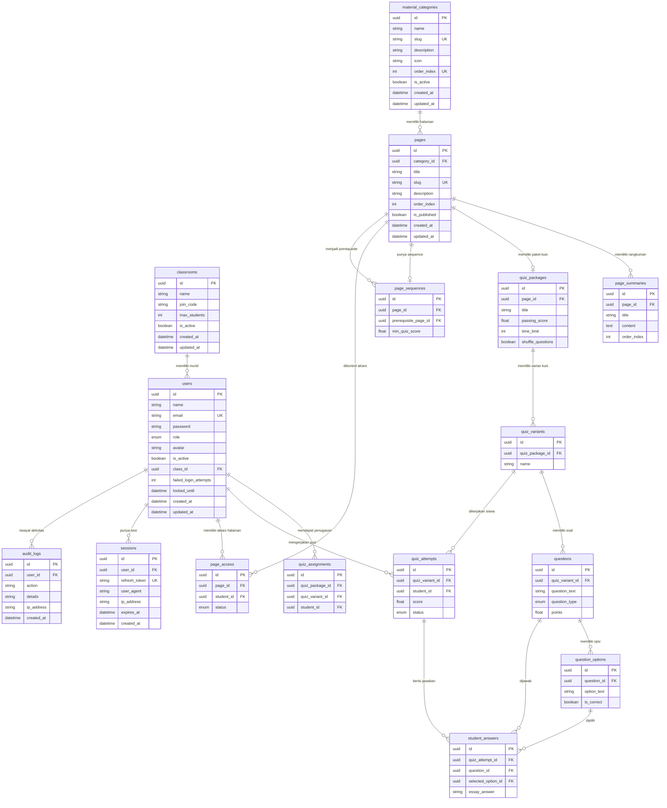
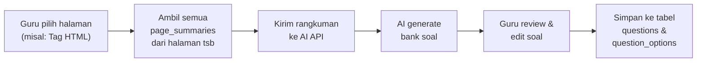
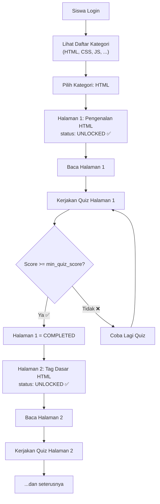

# 📐 ERD LMS v3 - WebPoint Learning Management System

> [!IMPORTANT]
> **Perubahan dari v2:**
> - Tambah tabel **`page_summaries`** untuk menyimpan rangkuman/isi materi per halaman
> - Rangkuman ini nantinya bisa digunakan **AI untuk generate bank soal**
> - Satu halaman bisa punya banyak section rangkuman (one-to-many)

---

## 1️⃣ ENUM

```sql
// ================================
// ENUM DEFINITIONS
// ================================

Enum Role {
  SUPERADMIN
  GURU
  MURID
}

Enum QuestionType {
  PILIHAN_GANDA
  ESSAY
}

Enum QuizAttemptStatus {
  IN_PROGRESS
  COMPLETED
  GRADED
}

Enum PageAccessStatus {
  LOCKED
  UNLOCKED
  COMPLETED
}
```

> [!NOTE]
> - `Role` — Hak akses: SUPERADMIN (kelola semua), GURU (kelola materi & quiz), MURID (belajar)
> - `QuestionType` — Tipe soal: Pilihan Ganda atau Essay
> - `QuizAttemptStatus` — IN_PROGRESS (sedang dikerjakan), COMPLETED (sudah submit), GRADED (sudah dinilai, khusus essay)
> - `PageAccessStatus` — LOCKED (halaman terkunci), UNLOCKED (bisa diakses), COMPLETED (sudah baca & lulus quiz)

---

## 2️⃣ TABLE

```sql
// ================================
// TABLE DEFINITIONS
// ================================

Table classrooms {
  id            String    [pk, note: 'UUID']
  name          String    [note: 'Contoh: XI RPL 2']
  join_code     String    [unique, note: 'Kode unik untuk murid join, misal RPL2-XYZ9']
  max_students  Int       [default: 32, note: 'Kapasitas maksimal kelas']
  is_active     Boolean   [default: true]
  created_at    DateTime  [default: `now()`]
  updated_at    DateTime
}

Table users {
  id            String    [pk, note: 'UUID']
  name          String
  email         String    [unique]
  password      String    [note: 'Hashed with bcrypt']
  role          Role      [default: 'MURID']
  avatar        String    [null]
  is_active             Boolean   [default: true, note: 'Akun bisa dinonaktifkan oleh Superadmin']
  class_id              String    [null, note: 'FK -> classrooms (Hanya untuk MURID)']
  failed_login_attempts Int       [default: 0, note: 'Tracking gagal login berturut-turut untuk anti brute-force']
  locked_until          DateTime  [null, note: 'Batas waktu akun terkunci akibat brute-force']
  created_at            DateTime  [default: `now()`]
  updated_at            DateTime
}

Table sessions {
  id              String    [pk, note: 'UUID']
  user_id         String    [note: 'FK → users']
  refresh_token   String    [null, unique]
  user_agent      String    [null]
  ip_address      String    [null]
  expires_at      DateTime
  created_at      DateTime  [default: `now()`]
}

Table audit_logs {
  id              String    [pk, note: 'UUID']
  user_id         String    [null, note: 'FK → users']
  action          String    [note: 'Contoh: LOGIN_SUCCESS, DELETE_MATERIAL']
  details         String    [null, note: 'Detail aktivitas (JSON/Text)']
  ip_address      String    [null]
  created_at      DateTime  [default: `now()`]
}

Table material_categories {
  id            String    [pk, note: 'UUID']
  name          String    [note: 'Contoh: HTML, CSS, JavaScript, PHP, Bootstrap']
  slug          String    [unique, note: 'URL-friendly, contoh: html, css, js']
  description   String    [null]
  icon          String    [null, note: 'Nama icon atau path gambar']
  order_index   Int       [unique, note: 'Urutan kategori di sidebar/menu']
  is_active     Boolean   [default: true]
  created_at    DateTime  [default: `now()`]
  updated_at    DateTime
}

Table pages {
  id            String    [pk, note: 'UUID']
  category_id   String    [note: 'FK → material_categories']
  title         String    [note: 'Contoh: Pengenalan HTML, Tag Dasar HTML']
  slug          String    [unique, note: 'URL path, contoh: pengenalan-html → /materi/html/pengenalan-html']
  description   String    [null, note: 'Deskripsi singkat halaman']
  order_index   Int       [note: 'Urutan halaman dalam kategori']
  is_published  Boolean   [default: false, note: 'Guru bisa draft/publish halaman']
  created_at    DateTime  [default: `now()`]
  updated_at    DateTime

  Note: 'Unique constraint pada [category_id, order_index]'
}

Table page_summaries {
  id            String    [pk, note: 'UUID']
  page_id       String    [note: 'FK → pages']
  title         String    [note: 'Judul section rangkuman, contoh: Tag Heading, Tag Paragraf']
  content       String    [note: 'Isi rangkuman materi dalam markdown/text. Digunakan AI untuk generate bank soal']
  order_index   Int       [note: 'Urutan section dalam halaman']
  created_at    DateTime  [default: `now()`]
  updated_at    DateTime

  Note: 'Menyimpan rangkuman materi per section. Satu halaman bisa punya banyak section rangkuman. Data ini bisa di-feed ke AI untuk generate soal otomatis.'
}

Table page_sequences {
  id                    String    [pk, note: 'UUID']
  page_id               String    [unique, note: 'FK → pages (halaman yang akan di-unlock)']
  prerequisite_page_id  String    [null, note: 'FK → pages (halaman yang harus diselesaikan dulu). NULL = halaman pertama, langsung terbuka']
  min_quiz_score        Float     [default: 70.0, note: 'Skor minimum quiz prerequisite untuk membuka halaman ini']
  created_at            DateTime  [default: `now()`]
  updated_at            DateTime

  Note: 'Mendefinisikan: "Untuk membuka page X, siswa harus menyelesaikan page Y dengan skor >= min_quiz_score"'
}

Table quiz_packages {
  id            String    [pk, note: 'UUID']
  page_id       String    [unique, note: 'FK → pages (1 halaman = 1 quiz)']
  title         String
  description   String    [null]
  passing_score Float     [default: 70.0, note: 'Skor minimum untuk lulus quiz ini']
  time_limit    Int       [null, note: 'Batas waktu dalam menit, null = tanpa batas']
  shuffle_questions Boolean [default: false, note: 'Acak soal saat ditampilkan']
  is_active     Boolean   [default: true]
  created_at    DateTime  [default: `now()`]
  updated_at    DateTime
}

Table quiz_variants {
  id              String    [pk, note: 'UUID']
  quiz_package_id String    [note: 'FK ? quiz_packages']
  name            String    [note: 'Contoh: Paket A, Paket B']
  created_at      DateTime  [default: `now()`]
  updated_at      DateTime
}

Table questions {
  id            String        [pk, note: 'UUID']
  quiz_variant_id String        [note: 'FK -> quiz_variants']
  question_text String        [note: 'Isi pertanyaan']
  question_type QuestionType  [default: 'PILIHAN_GANDA']
  points        Float         [default: 1.0, note: 'Bobot nilai soal']
  order_index   Int           [note: 'Urutan soal dalam quiz']
  created_at    DateTime      [default: `now()`]
  updated_at    DateTime
}

Table question_options {
  id            String    [pk, note: 'UUID']
  question_id   String    [note: 'FK → questions']
  option_text   String    [note: 'Teks pilihan jawaban']
  is_correct    Boolean   [default: false, note: 'Tandai sebagai kunci jawaban']
  order_index   Int       [note: 'Urutan opsi']
}

Table quiz_assignments {
  id              String    [pk, note: 'UUID']
  quiz_package_id String    [note: 'FK -> quiz_packages']
  quiz_variant_id String    [note: 'FK -> quiz_variants']
  student_id      String    [note: 'FK -> users']
  assigned_at     DateTime  [default: `now()`]

  Note: 'Unique constraint pada [quiz_package_id, student_id]'
}

Table quiz_attempts {
  id            String            [pk, note: 'UUID']
  quiz_variant_id String        [note: 'FK -> quiz_variants']
  student_id    String            [note: 'FK → users (MURID)']
  score         Float             [null, note: 'Skor akhir, null jika belum selesai']
  status        QuizAttemptStatus [default: 'IN_PROGRESS']
  started_at    DateTime          [default: `now()`]
  finished_at   DateTime          [null]
}

Table student_answers {
  id                 String    [pk, note: 'UUID']
  quiz_attempt_id    String    [note: 'FK → quiz_attempts']
  question_id        String    [note: 'FK → questions']
  selected_option_id String    [null, note: 'FK → question_options (untuk Pilihan Ganda)']
  essay_answer       String    [null, note: 'Jawaban essay (untuk tipe ESSAY)']
  is_correct         Boolean   [null, note: 'null = belum dinilai (essay oleh guru)']
  points_earned      Float     [default: 0]
}

Table page_access {
  id            String           [pk, note: 'UUID']
  page_id       String           [note: 'FK → pages']
  student_id    String           [note: 'FK → users (MURID)']
  status        PageAccessStatus [default: 'LOCKED']
  unlocked_at   DateTime         [null, note: 'Waktu halaman di-unlock']
  completed_at  DateTime         [null, note: 'Waktu halaman selesai (quiz lulus)']

  Note: 'Unique constraint pada [page_id, student_id]. Mengontrol halaman mana yang bisa diakses oleh siswa tertentu.'
}
```

---

## 3️⃣ RELATION

```sql
// ================================
// RELATION DEFINITIONS
// ================================

// User memiliki banyak Session dan Audit Log
Ref: users.class_id > classrooms.id
Ref: sessions.user_id > users.id
Ref: audit_logs.user_id > users.id

// Halaman (pages) milik satu Kategori
Ref: pages.category_id > material_categories.id

// Halaman punya banyak Rangkuman (section)
Ref: page_summaries.page_id > pages.id

// Sequence: halaman ini membutuhkan prerequisite halaman lain
Ref: page_sequences.page_id - pages.id
Ref: page_sequences.prerequisite_page_id > pages.id

// Setiap Halaman bisa punya satu Quiz (opsional, one-to-one)
Ref: quiz_packages.page_id - pages.id
Ref: quiz_variants.quiz_package_id > quiz_packages.id

// Quiz terdiri dari banyak Question
Ref: questions.quiz_variant_id > quiz_variants.id

// Question (Pilihan Ganda) punya banyak Option
Ref: question_options.question_id > questions.id

// Quiz Attempt dilakukan oleh satu Student pada satu Quiz
Ref: quiz_assignments.quiz_package_id > quiz_packages.id
Ref: quiz_assignments.quiz_variant_id > quiz_variants.id
Ref: quiz_assignments.student_id > users.id
Ref: quiz_attempts.quiz_variant_id > quiz_variants.id
Ref: quiz_attempts.student_id > users.id

// Student Answer menyimpan jawaban per soal dalam satu Attempt
Ref: student_answers.quiz_attempt_id > quiz_attempts.id
Ref: student_answers.question_id > questions.id
Ref: student_answers.selected_option_id > question_options.id

// Page Access mengontrol akses halaman per Student
Ref: page_access.page_id > pages.id
Ref: page_access.student_id > users.id
```

---

## 📊 ERD Diagram (Visual)



---

## 🤖 Alur AI Generate Bank Soal



### Contoh Data `page_summaries`

| page | title | content |
|------|-------|---------|
| Tag HTML | Tag Heading | `Tag heading digunakan untuk membuat judul. Ada 6 level: <h1> sampai <h6>. <h1> adalah heading terbesar...` |
| Tag HTML | Tag Paragraf | `Tag <p> digunakan untuk membuat paragraf. Teks di dalam tag <p> akan ditampilkan sebagai satu blok...` |
| Tag HTML | Tag Link | `Tag <a> digunakan untuk membuat hyperlink. Atribut href menentukan URL tujuan. Contoh: <a href="...">...` |
| Tag HTML | Tag Gambar | `Tag  digunakan untuk menampilkan gambar. Atribut src menentukan path gambar, alt untuk teks alternatif...` |

> [!TIP]
> **Kenapa multi-section (one-to-many)?**
> - AI menghasilkan soal yang **lebih spesifik & akurat** jika input-nya per section, bukan satu blob besar
> - Guru bisa menambah/edit rangkuman per topik tanpa mengganggu section lain
> - Bisa melacak dari section mana soal di-generate

---

## 🔄 Alur Sequential Learning



---

## 🗂️ Contoh Data Kategori & Halaman

| Kategori | order | Halaman | order | slug |
|----------|-------|---------|-------|------|
| HTML | 1 | Pengenalan HTML | 1 | `pengenalan-html` |
| HTML | 1 | Tag Dasar HTML | 2 | `tag-dasar-html` |
| HTML | 1 | Form HTML | 3 | `form-html` |
| CSS | 2 | Pengenalan CSS | 1 | `pengenalan-css` |
| CSS | 2 | Selector CSS | 2 | `selector-css` |
| JavaScript | 3 | Pengenalan JS | 1 | `pengenalan-js` |

**URL Pattern**: `/materi/{category_slug}/{page_slug}`
Contoh: `/materi/html/pengenalan-html`

---

## 🔐 Contoh Page Sequences (Prerequisite)

| Halaman | Prerequisite | Min Score |
|---------|-------------|-----------|
| Pengenalan HTML | `NULL` (langsung terbuka) | - |
| Tag Dasar HTML | Pengenalan HTML | 70 |
| Form HTML | Tag Dasar HTML | 70 |
| Pengenalan CSS | Form HTML | 70 |
| Selector CSS | Pengenalan CSS | 70 |

> [!TIP]
> `prerequisite_page_id = NULL` berarti halaman tersebut adalah **halaman pertama** yang langsung terbuka saat siswa pertama kali masuk. Guru/Superadmin bisa mengatur prerequisite lintas kategori (misal: selesai semua HTML dulu baru bisa akses CSS).

---

## 🔐 Role & Akses

| Role | Kemampuan |
|------|-----------|
| **SUPERADMIN** | Kelola semua user, override lock/unlock halaman, kelola kategori & halaman, lihat semua data |
| **GURU** | Kelola kategori & halaman, buat quiz & soal, **tulis rangkuman materi**, atur sequence, lihat progress murid, manual lock/unlock |
| **MURID** | Akses halaman yang UNLOCKED, kerjakan quiz, lihat nilai & progress sendiri |

---

## 📝 Script Gabungan (Copy ke dbdiagram.io)

<details>
<summary>Klik untuk melihat script gabungan lengkap</summary>

```sql
// ================================
// ENUM DEFINITIONS
// ================================

Enum Role {
  SUPERADMIN
  GURU
  MURID
}

Enum QuestionType {
  PILIHAN_GANDA
  ESSAY
}

Enum QuizAttemptStatus {
  IN_PROGRESS
  COMPLETED
  GRADED
}

Enum PageAccessStatus {
  LOCKED
  UNLOCKED
  COMPLETED
}

// ================================
// TABLE DEFINITIONS
// ================================

Table classrooms {
  id            String    [pk, note: 'UUID']
  name          String    [note: 'Contoh: XI RPL 2']
  join_code     String    [unique, note: 'Kode unik untuk murid join, misal RPL2-XYZ9']
  max_students  Int       [default: 32, note: 'Kapasitas maksimal kelas']
  is_active     Boolean   [default: true]
  created_at    DateTime  [default: `now()`]
  updated_at    DateTime
}

Table users {
  id                    String    [pk, note: 'UUID']
  name                  String
  email                 String    [unique]
  password              String    [note: 'Hashed with bcrypt']
  role                  Role      [default: 'MURID']
  avatar                String    [null]
  is_active             Boolean   [default: true, note: 'Akun dinonaktifkan oleh Superadmin']
  class_id              String    [null, note: 'FK -> classrooms (Hanya untuk MURID)']
  failed_login_attempts Int       [default: 0, note: 'Anti brute-force']
  locked_until          DateTime  [null, note: 'Batas waktu akun terkunci']
  created_at            DateTime  [default: `now()`]
  updated_at            DateTime
}

Table sessions {
  id              String    [pk, note: 'UUID']
  user_id         String    [note: 'FK → users']
  refresh_token   String    [null, unique]
  user_agent      String    [null]
  ip_address      String    [null]
  expires_at      DateTime
  created_at      DateTime  [default: `now()`]
}

Table audit_logs {
  id              String    [pk, note: 'UUID']
  user_id         String    [null, note: 'FK → users']
  action          String    [note: 'Contoh: LOGIN_SUCCESS']
  details         String    [null]
  ip_address      String    [null]
  created_at      DateTime  [default: `now()`]
}

Table material_categories {
  id            String    [pk, note: 'UUID']
  name          String    [note: 'Contoh: HTML, CSS, JavaScript, PHP, Bootstrap']
  slug          String    [unique, note: 'URL-friendly, contoh: html, css, js']
  description   String    [null]
  icon          String    [null, note: 'Nama icon atau path gambar']
  order_index   Int       [unique, note: 'Urutan kategori di sidebar/menu']
  is_active     Boolean   [default: true]
  created_at    DateTime  [default: `now()`]
  updated_at    DateTime
}

Table pages {
  id            String    [pk, note: 'UUID']
  category_id   String    [note: 'FK → material_categories']
  title         String    [note: 'Contoh: Pengenalan HTML, Tag Dasar HTML']
  slug          String    [unique, note: 'URL path, contoh: pengenalan-html']
  description   String    [null, note: 'Deskripsi singkat halaman']
  order_index   Int       [note: 'Urutan halaman dalam kategori']
  is_published  Boolean   [default: false, note: 'Guru bisa draft/publish halaman']
  created_at    DateTime  [default: `now()`]
  updated_at    DateTime

  Note: 'Unique constraint pada [category_id, order_index]'
}

Table page_summaries {
  id            String    [pk, note: 'UUID']
  page_id       String    [note: 'FK → pages']
  title         String    [note: 'Judul section rangkuman, contoh: Tag Heading, Tag Paragraf']
  content       String    [note: 'Isi rangkuman materi (markdown/text). Digunakan AI untuk generate bank soal']
  order_index   Int       [note: 'Urutan section dalam halaman']
  created_at    DateTime  [default: `now()`]
  updated_at    DateTime

  Note: 'Menyimpan rangkuman materi per section. Data ini bisa di-feed ke AI untuk generate soal otomatis.'
}

Table page_sequences {
  id                    String    [pk, note: 'UUID']
  page_id               String    [unique, note: 'FK → pages (halaman yang akan di-unlock)']
  prerequisite_page_id  String    [null, note: 'FK → pages (halaman yang harus diselesaikan). NULL = langsung terbuka']
  min_quiz_score        Float     [default: 70.0, note: 'Skor minimum quiz prerequisite untuk membuka halaman ini']
  created_at            DateTime  [default: `now()`]
  updated_at            DateTime

  Note: 'Mendefinisikan urutan prerequisite antar halaman'
}

Table quiz_packages {
  id            String    [pk, note: 'UUID']
  page_id       String    [unique, note: 'FK → pages (1 halaman = 1 quiz)']
  title         String
  description   String    [null]
  passing_score Float     [default: 70.0, note: 'Skor minimum untuk lulus']
  time_limit    Int       [null, note: 'Batas waktu dalam menit, null = tanpa batas']
  shuffle_questions Boolean [default: false]
  is_active     Boolean   [default: true]
  created_at    DateTime  [default: `now()`]
  updated_at    DateTime
}

Table quiz_variants {
  id              String    [pk, note: 'UUID']
  quiz_package_id String    [note: 'FK ? quiz_packages']
  name            String    [note: 'Contoh: Paket A, Paket B']
  created_at      DateTime  [default: `now()`]
  updated_at      DateTime
}

Table questions {
  id            String        [pk, note: 'UUID']
  quiz_variant_id String        [note: 'FK -> quiz_variants']
  question_text String        [note: 'Isi pertanyaan']
  question_type QuestionType  [default: 'PILIHAN_GANDA']
  points        Float         [default: 1.0, note: 'Bobot nilai soal']
  order_index   Int           [note: 'Urutan soal dalam quiz']
  created_at    DateTime      [default: `now()`]
  updated_at    DateTime
}

Table question_options {
  id            String    [pk, note: 'UUID']
  question_id   String    [note: 'FK -> questions']
  option_text   String    [note: 'Teks pilihan jawaban']
  is_correct    Boolean   [default: false, note: 'Kunci jawaban']
  order_index   Int       [note: 'Urutan opsi']
}

Table quiz_assignments {
  id              String    [pk, note: 'UUID']
  quiz_package_id String    [note: 'FK -> quiz_packages']
  quiz_variant_id String    [note: 'FK -> quiz_variants']
  student_id      String    [note: 'FK -> users']
  assigned_at     DateTime  [default: `now()`]

  Note: 'Unique constraint pada [quiz_package_id, student_id]'
}

Table quiz_attempts {
  id            String            [pk, note: 'UUID']
  quiz_variant_id String          [note: 'FK -> quiz_variants']
  student_id    String            [note: 'FK -> users (MURID)']
  score         Float             [null, note: 'Skor akhir, null jika belum selesai']
  status        QuizAttemptStatus [default: 'IN_PROGRESS']
  started_at    DateTime          [default: `now()`]
  finished_at   DateTime          [null]
}

Table student_answers {
  id                 String    [pk, note: 'UUID']
  quiz_attempt_id    String    [note: 'FK → quiz_attempts']
  question_id        String    [note: 'FK → questions']
  selected_option_id String    [null, note: 'FK → question_options (Pilihan Ganda)']
  essay_answer       String    [null, note: 'Jawaban essay']
  is_correct         Boolean   [null, note: 'null = belum dinilai']
  points_earned      Float     [default: 0]
}

Table page_access {
  id            String           [pk, note: 'UUID']
  page_id       String           [note: 'FK → pages']
  student_id    String           [note: 'FK → users (MURID)']
  status        PageAccessStatus [default: 'LOCKED']
  unlocked_at   DateTime         [null]
  completed_at  DateTime         [null]

  Note: 'Unique constraint pada [page_id, student_id]'
}

// ================================
// RELATION DEFINITIONS
// ================================

Ref: users.class_id > classrooms.id
Ref: sessions.user_id > users.id
Ref: audit_logs.user_id > users.id
Ref: pages.category_id > material_categories.id
Ref: page_summaries.page_id > pages.id
Ref: page_sequences.page_id - pages.id
Ref: page_sequences.prerequisite_page_id > pages.id
Ref: quiz_packages.page_id - pages.id
Ref: quiz_variants.quiz_package_id > quiz_packages.id
Ref: questions.quiz_variant_id > quiz_variants.id
Ref: question_options.question_id > questions.id
Ref: quiz_assignments.quiz_package_id > quiz_packages.id
Ref: quiz_assignments.quiz_variant_id > quiz_variants.id
Ref: quiz_assignments.student_id > users.id
Ref: quiz_attempts.quiz_variant_id > quiz_variants.id
Ref: quiz_attempts.student_id > users.id
Ref: student_answers.quiz_attempt_id > quiz_attempts.id
Ref: student_answers.question_id > questions.id
Ref: student_answers.selected_option_id > question_options.id
Ref: page_access.page_id > pages.id
Ref: page_access.student_id > users.id
```

</details>


